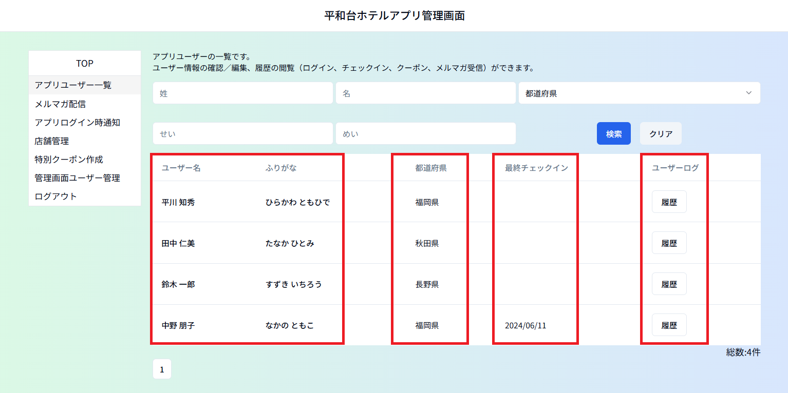

# ①アプリユーザー一覧

アプリに登録されているお客様の一覧です。
登録情報の確認／編集、履歴（ログイン、チェックイン、クーポン、メルマガ受信）の閲覧が
できます。
新規ユーザー登録を管理画面から行うことはできません。
検索を実行前はアプリユーザーが一覧表示されます。（更新が古い順）

### ユーザー名／ふりがな：アプリに登録のお客様の姓名
　　　　　　　　　　　ユーザー名／ふりがないずれかをクリックすると
　　　　　　　　　　　ユーザー情報の詳細を確認／編集できます。

### 都　道　府　県　：居住都道府県

### 最終チェックイン：店舗に設置のQRコードでアプリでチェックインされた
　　　　　　　　　最終の履歴

### ユ ー ザ ー  ロ グ  ：「履歴」ボタンをクリックし、下記を確認できます。

　　　　　　　　　　　・**ログイン履歴
　　　　　　　　　　　・チェックイン履歴（店舗・時間）
　　　　　　　　　　　・クーポン履歴（クーポン名・発行日時・有効期限・使用日時）
　　　　　　　　　　　・メルマガ受信履歴**

ーーーーーーーーーーーーーーーーーーーーーーーーーーーーーーーーーーーーーーーーーーーー

## ＜検索方法＞

姓（漢字／かな）、名（漢字／かな）、居住都道府県から検索できます。
1つの要素で検索することも（例：姓「田中」で検索）、
複数の要素で検索することも（例：姓「田中」、都道府県「福岡県」で検索）可能です。

※都道府県を一度選択して、その選択を解除する場合には「クリア」をクリックし、最初から
　検索し直してください。

ーーーーーーーーーーーーーーーーーーーーーーーーーーーーーーーーーーーーーーーーーーーー

## ＜登録内容の変更方法＞

該当のユーザーのユーザー名／ふりがな のいずれかをクリックし編集画面を開きます。
登録内容を変更後、画面下方の「変更」ボタンをクリックします。

※アプリ使用禁止の設定（ログインできなくなります）、ユーザー削除もここからできます。

**※メールアドレスの登録は管理画面からは変更できません。**

「変更」をクリックすると確認のウィンドウが出るので「ＯＫ」をクリックします。

「一覧へ戻る」をクリックし、前の画面に戻るか、画面左側のメニューリストから他のメニューへ移動します。