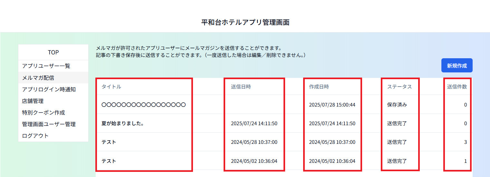
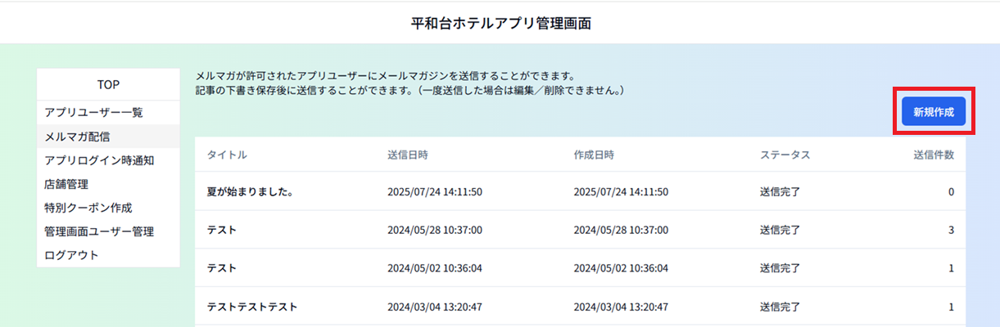

# ②メルマガ配信

メルマガ受信可のお客様にメールマガジンを送信できます。 
※送信済のメルマガは編集／削除できません。

タ イ ト ル ：送信済／作成中のメルマガのタイトル 
　　　　　タイトルをクリックすると、送信済なら内容の確認ができ、 
　　　　　作成中なら編集画面が開き、編集できます。

送 信 日 時 ：送信済なら送信日時、作成中（未発信）なら空欄

作 成 日 時 ：最終の保存／更新日時

ス テ ー タ ス ：送信完了／保存済みいずれかのメルマガの状況を表示

送 信 件 数 ：メルマガを送信したユーザー数 
　　　　　　作成中の場合は0と表示します。 
　　　　　　送信予定者数はメルマガ編集画面で確認できます。 

ーーーーーーーーーーーーーーーーーーーーーーーーーーーーーーーーーーーーーーーーーーーーーーーーーーーーーーーーーーーーーーーーーーー 

## ＜メルマガ新規作成方法＞

１）「新規作成」をクリックします。　　

２）タイトル、本文を入力し、送信対象の都道府県を選択、「保存」ボタンをクリックします。

　タ イ ト ル ：Eメールの件名に表示されます。 
　本　　文：Eメールの本文に表示されます 
　都道府県：メルマガ送信対象者を居住の都道府県で絞り込みできます。 
　　　　　　何も選択しない場合は全員に配信されます。 

※「送信」ボタンは保存後でないとクリックできない状態になっています。 

「保存」をクリックすると確認のウィンドウが出るので「ＯＫ」をクリックします。 

「保存」をクリック後、都道府県選択欄の下方にメルマガ送信予定者数が「未送信ユーザー数」として表示されます。

３ー１）メルマガを送信する場合：「送信」ボタンをクリックして完了です。

「送信」をクリックすると確認のウィンドウが２回出ます。
「ＯＫ」を２回クリックしてください。

３－２）メルマガを一時保存しておく場合： 
　　　　「一覧へ戻る」をクリックし、前の画面に戻るか、画面左側のメニューリストから他のメニューへ移動します。

 
 
 
## ＜一時保存したメルマガの再編集方法＞

メルマガ一覧から該当のメルマガのタイトルをクリックして編集画面を開きます。
編集後は「更新」ボタンをクリックして変更内容を上書き保存してください。

**※送信前に必ず「更新」ボタンをクリックしてください。 
　更新せずに「送信」ボタンをクリックすると変更前の内容でメルマガが送信されるためご注意ください。** 
※一度「保存」済のため「送信」ボタンはクリックできる状態です。

「更新」をクリックすると確認のウィンドウが出るので「ＯＫ」をクリックします。
 
 
 
## ＜作成中のメルマガの削除方法＞

メルマガ一覧から該当のメルマガのタイトルをクリックして編集画面を開き、「削除」ボタンをクリックします。

**※削除するとデータは完全に消去されます。内容を後から確認／元に戻すことはできません。** 
**※送信済のメルマガは削除できません。**

「削除」をクリックすると確認のウィンドウが２回出ます。「ＯＫ」を２回クリックしてください。