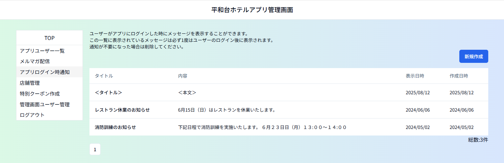

# ③アプリログイン時通知

お客様がアプリにログインされた時に表示するメッセージを管理するメニューです。 
メッセージを作成後、お客様が最初にログインされた時に一度だけメッセージが表示されます。 
**表示が不要になったメッセージは随時削除してください。** 
削除するまではメッセージを作成後、お客様の最初のログイン時にメッセージが表示されます。 
※一時保存の機能はありません。

タイトル：メッセージのタイトル 
　　　　タイトルをクリックすると、編集画面が開き、内容の確認／編集ができます。

内　　容：メッセージの内容

表示日時：ログイン時のメッセージに表示したい日付 
　　　　　※予約投稿などの機能はありません。ユーザーの画面には表示日順で並びます。

作成日時：メッセージを最初に作成した日 
 　　　　　上書変更しても、その変更日は作成日時に反映しません。

# ★★あとでアプリの画像いれる 

ーーーーーーーーーーーーーーーーーーーーーーーーーーーーーーーーーーーーーーーーーーーーーーーーーーーーーーーーーーーーーーーーーーー 

## ＜メッセージ作成方法＞

１）メルマガ配信メニューで「新規作成」をクリックします。 　　

２）タイトル、表示日、本文を入力します。 
　　表示日は表示開始日を指定する場合に、作成日以降の日付を指定してください。 

３）「保存」ボタンをクリックするとお客様がアプリログイン時にメッセージが通知されるようになります。 
　※一時保存機能はありません。「保存」をクリックするとアプリ上で表示が開始しますのでご注意ください。 

「保存」をクリックすると確認のウィンドウが出るので「ＯＫ」をクリックします。

「一覧へ戻る」をクリックし、前の画面に戻るか、画面左側のメニューリストから他のメニューへ移動します。
 
 
 
## ＜メッセージ削除方法＞

アプリログイン時通知一覧から該当のメッセージのタイトルをクリックして編集画面を開き、「削除」ボタンをクリックします。 
**※削除するとデータは完全に消去されます。内容を後から確認／元に戻すことはできません。**

「削除」をクリックすると確認のウィンドウが２回出ます。「ＯＫ」を２回クリックしてください。
 
 
 
## ＜通知中のメッセージの編集方法＞
アプリログイン時通知一覧から該当のメッセージのタイトルをクリックして編集画面を開き、内容を調整後、「更新」ボタンをクリックします。

**※過去のメッセージを編集した場合、そのメッセージを既読のお客様には表示されません。** 
　**すべてのユーザーに表示する必要がある場合はメッセージを新規作成をしてください。**
