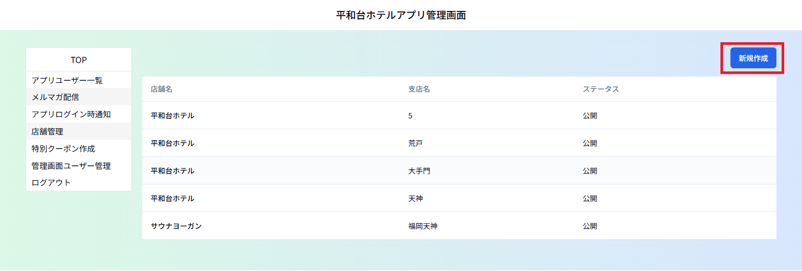
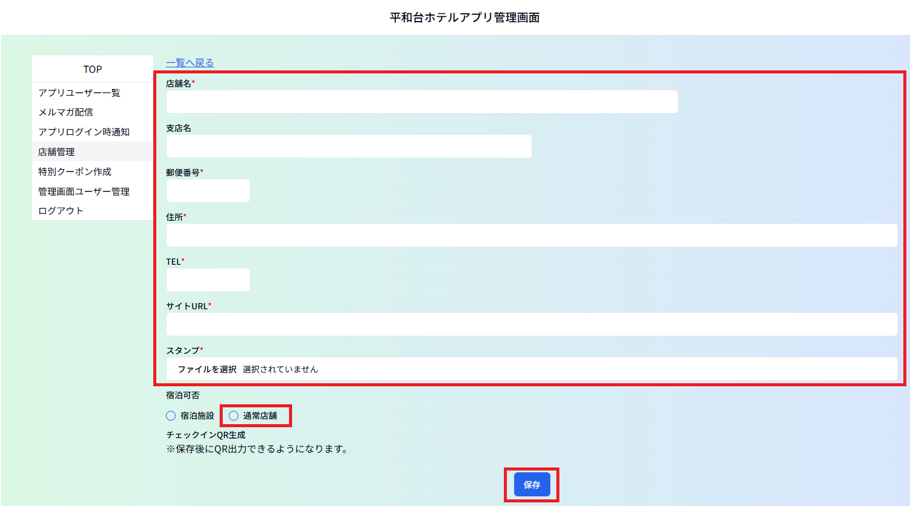
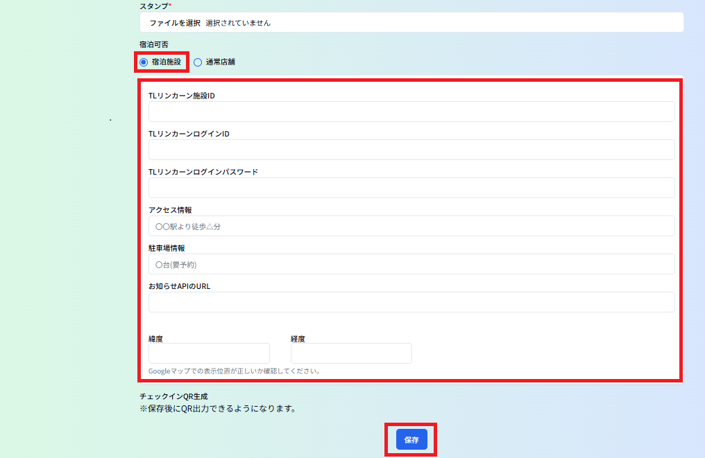
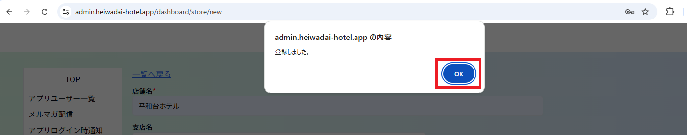
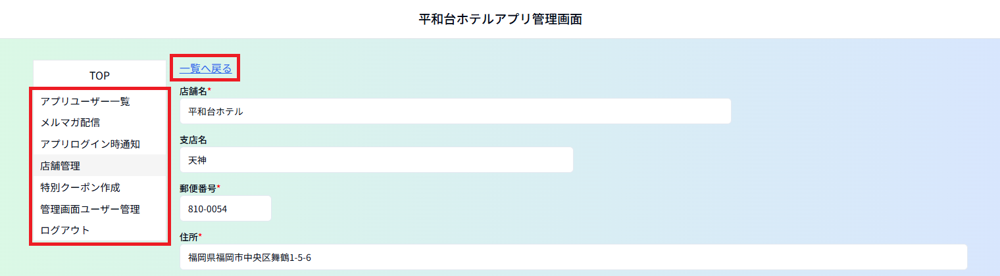
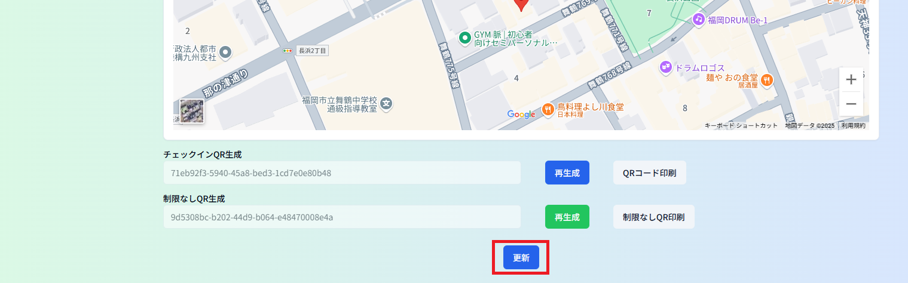
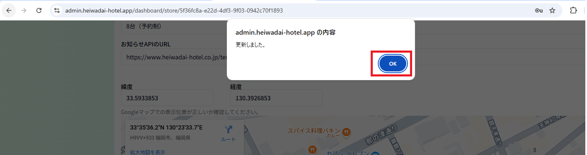
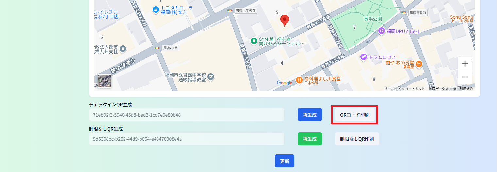
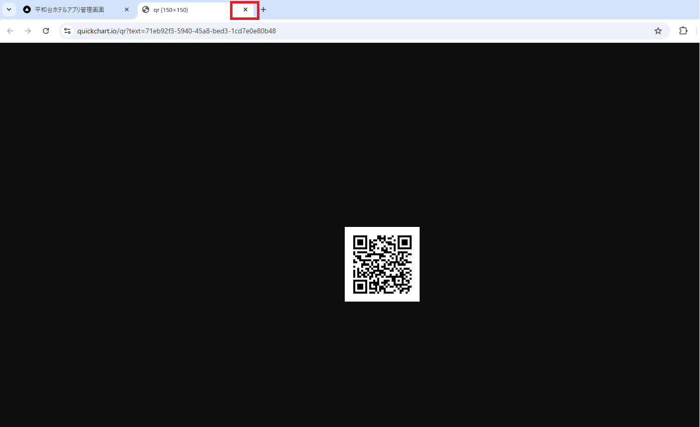
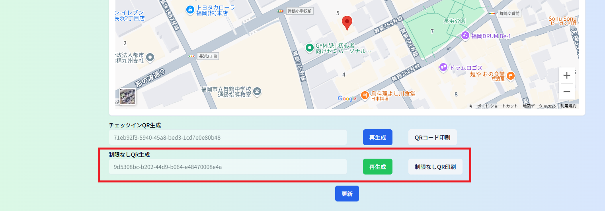

# ④店舗管理
店舗情報を管理するメニューです。 
店舗名をクリックすると編集画面になります。 
宿泊施設と通常店舗で登録内容が一部異なります。 
一度作った店舗マスタは削除できません。 
不要となった店舗マスタは表示ステータスを非表示にしてください。 

ーーーーーーーーーーーーーーーーーーーーーーーーーーーーーーーーーーーーーーーーーーーーーーーーーーー 

## ＜新規作成方法＞ 

１）メルマガ配信メニューで「新規作成」をクリックします。　　

２ー１）宿泊施設以外の店舗の場合 
　　　　店舗名からサイトＵＲＬまでを入力し、スタンプ画像をアップロードします。 
　　　　宿泊可否は「通常店舗」を選択し、「保存」をクリックします。

２－２）宿泊施設の場合 
　　　　２－１）同様にスタンプ画像アップロードまで行い、宿泊可否は「宿泊施設」を選択します。 
　　　　「宿泊施設」を選択すると下方に入力項目が追加表示されるので 
　　　　TLリンカーン施設ID以降の項目を入力し、「保存」をクリックしします。

※緯度・経度：店舗の所在地の緯度・経度を入力してください。 
　店舗の場所を示したGoogleマップが表示されます。位置が正しいかどうかそのマップ上で確認してください。 

「保存」をクリックすると確認のウィンドウが出るので「ＯＫ」をクリックします。 

「一覧へ戻る」をクリックし、前の画面に戻るか、画面左側のメニューリストから他のメニューへ移動します。
 
 
 
## ＜登録内容の変更方法＞ 

一覧から該当の店舗の店舗名をクリックして編集画面を開き、内容を調整後、画面下方の「更新」ボタンをクリックします。

「更新」をクリックすると確認のウィンドウが出るので「ＯＫ」をクリックします。
 
 
 
## ＜チェックインＱＲコードの印刷方法＞ 
一覧から該当の店舗の店舗名をクリックして編集画面を開き、チェックインＱＲ生成欄の「ＱＲコード印刷」をクリックします。 
新しいタブでＱＲコードが表示されるので印刷して使用してください。 
このＱＲコードで同一ユーザーがチェックインできるのは1日に１回だけです。

※「再生成」をクリックするとＱＲが新しいものに変更されます。 
　これまで使っていたＱＲコードではチェックインできなくなります。

ＱＲコード印刷後はタブの「×」で画面を消してください。
 
 
 
## ＜制限なしＱＲ生成について＞ 

１日に２回以上チェックインができるＱＲコードです。 
通常のチェックインＱＲコードと同様の方法でＱＲコードを印刷できます。 
