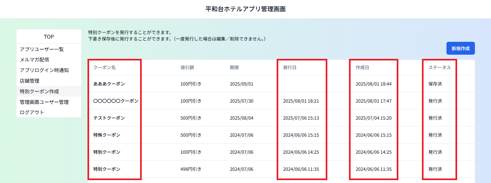
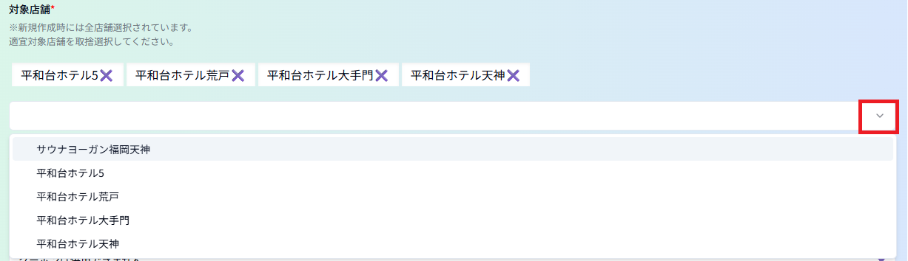

# ⑤特別クーポン作成
特別クーポン（誕生日クーポン、○○クーポン以外のクーポン）を発行するメニューです。 
※一度発行したクーポンは編集／削除できません 

ク ー ポ ン 名：発行済／一時保存中のクーポンの名称 　
　　　　　　クーポン名をクリックすると発行済なら内容の確認のみ、一時保存中なら編集ができます。 
発　行　日：クーポン発行日（未来の日付を指定して予約発行することはできません。） 
作　成　日：データの初回保存日時 
　　　　　　後で内容を更新してもここに表示される作成日時は当初作成日時です。 
ス テ ー タ ス：発行済かどうかが表示されます。 
　　　　　　　発行済／保存済（＝未発行） 

ーーーーーーーーーーーーーーーーーーーーーーーーーーーーーーーーーーーーーーーーーーーーーーーーーーー 

## ＜新規作成方法＞ 

１）「新規作成」をクリックします 

２）クーポン名、値引額、期限、対象店舗、併用可否、クーポン備考を入力／選択し、「保存」ボタンをクリックします。

※「送信」ボタンは保存後でないとクリックできない状態になっています。 

対象店舗：初期値では全店舗表示されています。 
　　　　　対象外の店舗は店舗名右の×をクリックして削除してください。 
　　　　　間違って削除した場合、すぐ下のプルダウンリストから該当の店舗名をクリックしてください。 

クーポン備考：「クーポンは併用できません」、「ランチではお使いになれません」の表記が不要な場合は 
　　　　　　　右の方の×をクリックして削除してください。 
　　　　　　　ほかに表記したい内容がある場合は「備考行追加」ボタンをクリックし、作成された行に入力 
　　　　　　してください。
 

３ー１）クーポンを発行する場合：「発行」ボタンをクリックして完了です。 

「発行」をクリックすると確認のウィンドウが２回出ます。「ＯＫ」を２回クリックしてください。 
※発行後は編集／削除できません。

３－２）一時保存しておく場合：　「一覧へ戻る」をクリックし、前の画面に戻るか、 
  　　　　画面左側のメニューリストから他のメニューへ移動します。 

 
 
 
## ＜一時保存した特別クーポンの再編集方法＞ 

特別クーポン一覧から該当のクーポンのクーポン名をクリックして編集画面を開きます。  
編集後は「更新」ボタンをクリックして変更内容を上書き保存してください。 

※発行前に必ず「更新」ボタンをクリックしてください。  
　「更新」ボタンをクリックせずに「発行」ボタンをクリックすると変更前の内容で特別クーポンが発行されるため 
　ご注意ください。 
※一度「保存」済のため「発行」ボタンはクリックできる状態です。 

「更新」をクリックすると確認のウィンドウが出るので「ＯＫ」をクリックします。