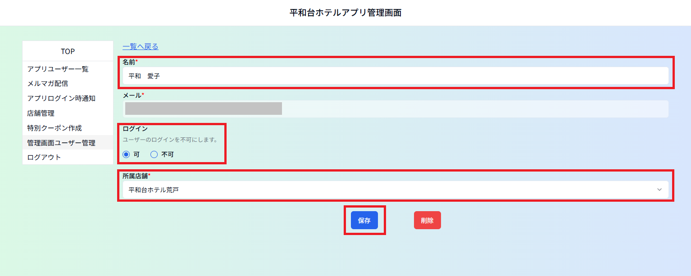

# ⑥管理画面ユーザー管理
管理画面にログインできるユーザーを作成／管理するメニューです。 
新規作成にはメールアドレスの認証が必要です。システムからのメールに対応してください。 

ーーーーーーーーーーーーーーーーーーーーーーーーーーーーーーーーーーーーーーーーーーーーーーーーーーーーーーーーーーーーーーーーーーー 

## ＜ユーザー新規作成方法＞ 

１）「新規作成」をクリックします 

２）名前、メールアドレスを入力し、所属店舗を選択、「保存」ボタンをクリックします。

「保存」をクリックすると確認のウィンドウが出るので「ＯＫ」をクリックします。
※パスワード設定のメールが送信されますので１時間以内に設定を行ってください。

## ＜パスワードの設定方法＞※ユーザー本人が行う設定です。 

新規ユーザー登録された方へは、登録のメールアドレスにシステムからパスワード設定のメールが届きます。 
※メール受信から１時間以内に行ってください。１時間経過するとリンクが無効になります。 
　無効になった場合はユーザーを削除し、再度作成しなおしてください。

１）「メールを確認する」をクリックします。
　※クリックするのは１回だけにしてください。

２）パスワードは数字・アルファベット（大文字＋小文字）を含む８文字以上で設定してください。 
　　入力後「設定」をクリックします。

「設定」をクリックすると確認のウィンドウが出るので「ＯＫ」をクリックします。

３）メールアドレス、パスワードを入力し、「ログイン」をクリックします。

## ＜ユーザー情報の編集方法＞ 

一覧から該当のユーザーの名前をクリックして編集画面を開き、内容を変更後、画面下方の「保存」ボタンを クリックします。名前、所属店舗は登録内容を変更できます。 
※メールアドレスの登録は変更できません。 

「保存」をクリックすると確認のウィンドウが出るので「ＯＫ」をクリックします。

## ＜ユーザーの削除方法＞ 

一覧から該当のユーザーの名前をクリックして編集画面を開き、内容を変更後、画面下方の「削除」ボタンを クリックします。

「削除」をクリックすると確認のウィンドウが２回出ます。
「ＯＫ」を２回クリックしてください。

