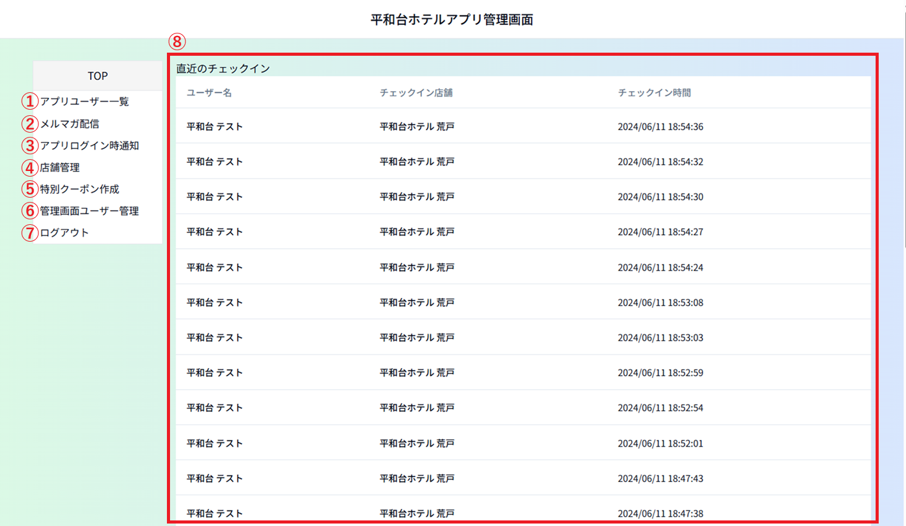

# アプリ管理画面　操作マニュアル

## 管理画面トップページのご説明

### ①アプリユーザー一覧 
アプリを利用されているお客様の登録情報の確認／編集のメニュー 
ログイン、チェックイン、クーポンの発行・使用、メルマガ受信の履歴も確認できます。 

### ②メルマガ配信 
メルマガ受信可のお客様にメールマガジンを送信するメニュー 

### ③アプリログイン時通知 
お客様がアプリにログインされた時に表示するメッセージを管理するメニュー 

### ④店舗管理 
アプリから予約、チェックインができる店舗を管理するメニュー 
2025年7月現在は、ホテル４店舗（天神、５、荒戸、大手門）とサウナヨーガンの５店舗が登録されています。

### ⑤特別クーポン作成 
特別クーポン（アプリチェックイン、お誕生日クーポン以外）を作成するメニュー

### ⑥管理画面ユーザー管理 
管理画面にログインできるユーザーを管理するメニュー

### ⑦ログアウト 
ここをクリックすると管理画面からログアウトします。

### ⑧直近のチェックイン 
お客様が店舗に設置のQRコードでチェックインされた履歴です。
直近の状況がトップ画面に表示されます。