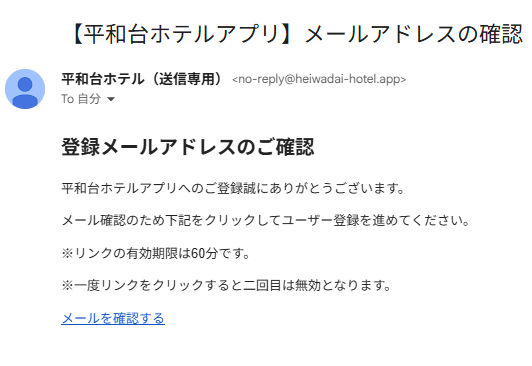

# ＜×＞管理画面ユーザー登録方法

## ①管理画面のユーザー登録のある人から招待メールを送信
　してもらい、「メールを確認する」をクリックする。

　※メール受信から１時間以内に設定を行ってください。

　※「メールを確認する」のリンクのクリックは１回だけにしてください。

## ②英数〇字～〇字以内でパスワードを決め、
　入力後、「設定」をクリックする。

## 下記のエラーが出る場合には、パスワードの条件を満たせていません。となるように再度決めなおしをお願いします。

管理画面URL：[https://admin.heiwadai-hotel.app/](https://admin.heiwadai-hotel.app/)

次回以降ログイン時は、Emailアドレス、パスワードを入力してログインする。

